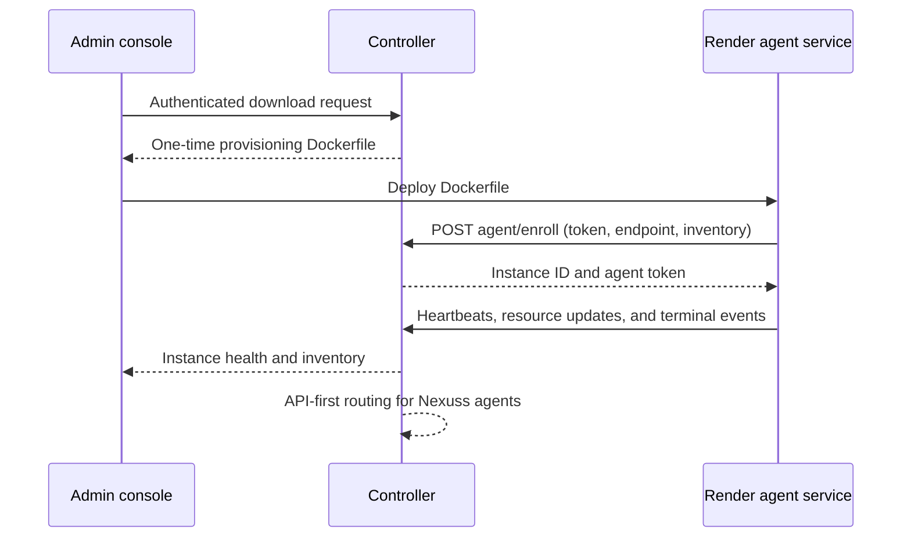

# Terminal-Kit Self-Enrollment Protocol

## Purpose

Terminal-Kit is a central control plane for many independently deployed terminal agents. The administrator downloads a single communication Dockerfile from the protected console, deploys it to an instance, and performs no further registration steps. On startup, the agent automatically reports its public endpoint, identity, health, and resource inventory to the controller.

> The Dockerfile is a **one-time enrollment credential**. It is not a general-purpose image and must be handled as a secret until the agent has enrolled.

## Trust Model

| Actor | Credential | Allowed action |
| --- | --- | --- |
| System administrator | `ADMIN_PASSWORD` held only in Render | Opens the console, downloads a provisioning Dockerfile, views inventory, and renames instances. |
| Nexuss AI | `CONTROLLER_API_KEY` bearer token | Lists instances, selects a resource preference, dispatches commands, supplies stdin, and consumes SSE output. |
| Remote agent | One-time enrollment token, then its issued agent token | Self-enrolls, reports health/resources, receives commands, and streams terminal events. |

The administrator password is exchanged only with the controller and creates a signed, HTTP-only session cookie. It is never embedded in the Dockerfile. The AI bearer key remains an API credential and is never needed by the browser console.

## Provisioning Flow

The agent determines its endpoint from `INSTANCE_PUBLIC_URL` when explicitly supplied, otherwise `RENDER_EXTERNAL_URL`. Render provides `RENDER_EXTERNAL_URL` for web services and static sites as the full `onrender.com` URL.[1] A deployment that uses a custom domain should set `INSTANCE_PUBLIC_URL` to that custom HTTPS endpoint.

## Agent Metadata Contract

At enrollment and on each heartbeat, the agent submits the fields below. The controller treats agent data as operational telemetry; only a valid enrollment or agent token can update it.

| Group | Fields |
| --- | --- |
| Identity | `hostname`, `agentVersion`, `osPlatform`, `architecture`, `endpoint` |
| Capacity | `cpuCount`, `memoryTotalMb`, `diskTotalMb`, `diskFreeMb` |
| Live usage | `cpuPercent`, `memoryPercent`, `diskPercent`, `activeSessions` |
| Health | `status`, `lastSeenAt`, protocol version |

The controller maintains both per-instance records and a global resource summary: registered/online/offline counts, total and available RAM, total/free disk, CPU capacity, current active sessions, and the oldest observed heartbeat.

## Routing Contract

`POST /api/v1/commands` keeps explicit `instanceId` support. Without it, a Nexuss AI may state `resourcePreference` as `balanced`, `memory`, `disk`, or `cpu`. The controller considers only online agents and ranks them by the requested headroom alongside active-session load.

## Render Configuration

The controller remains a Render Web Service. The only new secret is `ADMIN_PASSWORD`, added in the Render Environment panel. Render keeps environment-variable values separate from source control and can redeploy a service with saved environment changes.[2]

No Manus OAuth, ParadoxDB credential, Telegram credential, browser-held controller key, instance name, or instance URL is required for administrator provisioning.

## References

[1]: https://render.com/docs/environment-variables "Render Default Environment Variables"
[2]: https://render.com/docs/configure-environment-variables "Render Environment Variables and Secrets"
